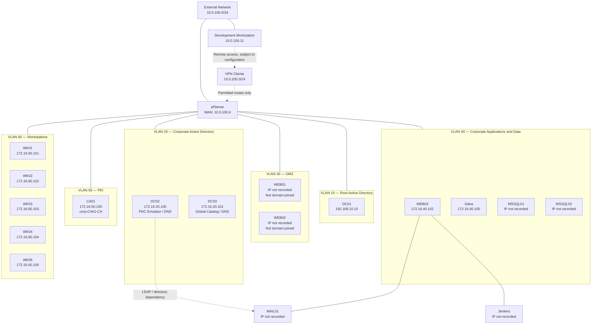
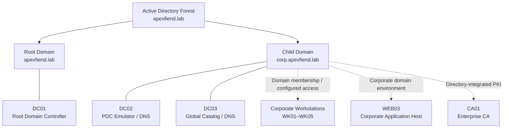
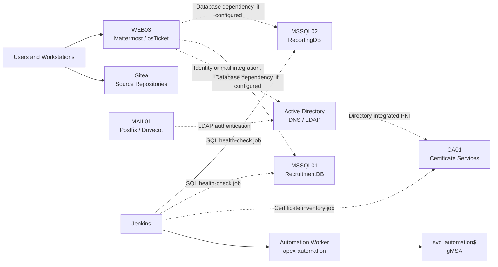
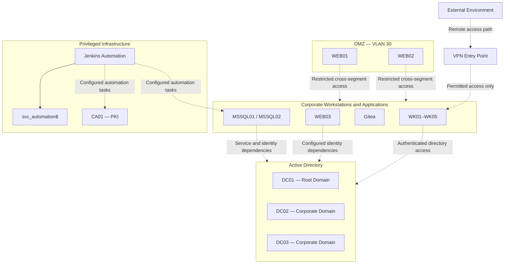
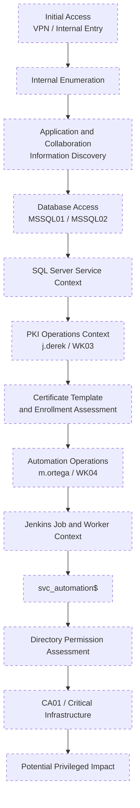

# Architecture Diagrams

## 1. Purpose

This document provides visual representations of the Apexfiend architecture using Mermaid diagrams.

The diagrams summarize the network segments, Active Directory structure, major infrastructure dependencies, and selected security boundaries. They are intended to complement the detailed descriptions in:

* `network-architecture.md`
* `system-inventory.md`
* `firewall-and-routing.md`
* `infrastructure-dependencies.md`
* `trust-boundaries.md`

The diagrams represent the documented design. A connection between components indicates an architectural relationship or potential dependency, not necessarily unrestricted network access or a fully validated attack path.

## 2. Network Topology

The following diagram shows the main network segments and their known components. pfSense provides the network gateway and firewall role. Actual routing and permitted traffic depend on its configuration.

**Diagram notes**

* VLANs are shown as logical segments connected through the firewall. The diagram does not imply that every segment can communicate freely with every other segment.
* The exact attachment of MAIL01 and Jenkins to their network interfaces should be updated if their final placement differs from the current design.
* Server addresses marked as not recorded should be filled in after verification.
* The VPN relationship represents remote access at an architectural level; the actual client routes and firewall permissions must be checked separately.

## 3. Active Directory and Identity Structure

This diagram represents the forest and the major identity-related infrastructure. It does not attempt to show every organizational unit, group, or access control entry.

**Diagram notes**

* DC01 belongs to the root domain. DC02 and DC03 belong to the corporate child domain.
* The diagram indicates domain placement, not the exact replication, trust, or authentication traffic.
* WEB01 and WEB02 are intentionally omitted from the domain-membership relationships because they are not domain-joined.
* The effective privileges of users and service accounts depend on their actual memberships and permissions.

## 4. Application and Service Dependencies

This diagram highlights the principal application and infrastructure relationships. Some connections represent dependencies to validate rather than confirmed direct integrations.

**Diagram notes**

* The LDAP relationship between MAIL01 and Active Directory was tested during setup.
* Mattermost and osTicket are hosted on WEB03. Their additional database, mail, or directory integrations should be confirmed from the deployed configuration.
* Jenkins includes jobs for certificate inventory and SQL health checks. The actual targets, execution identities, and required permissions should be confirmed from the job definitions and scripts.
* The diagram does not imply that the gMSA has administrative rights over the CA or SQL Server.

## 5. Security Boundary Overview

The following diagram groups components by their principal security context.

**Diagram notes**

* The DMZ, corporate environment, Active Directory, and privileged infrastructure are separate security contexts.
* Dashed lines denote conceptual or conditional relationships, not verified firewall permissions.
* The diagram intentionally does not show a direct route from every lower-trust component to every higher-trust component.
* A valid security assessment should establish the exact conditions required to cross each boundary.

## 6. High-Level Assessment Path

The following is a high-level representation of the intended assessment scenario. It is not a substitute for the detailed attack-path documentation, and it does not assert that the entire chain has been validated end to end.

**Diagram notes**

* Dashed styling indicates that the diagram is a conceptual scenario requiring validation, not that every step has been proven.
* The exact transition conditions, evidence, and status of each step belong in `attack-path.md`.
* Do not publish credentials, tokens, hashes, private keys, or other reusable authentication material in these diagrams or their supporting documentation.
* Update the diagram if testing changes the order of the path or shows that a transition is not viable.

## 7. Diagram Maintenance

When updating these diagrams:

* Keep hostnames, domain names, VLAN assignments, and confirmed IP addresses consistent with `system-inventory.md`.
* Mark unconfirmed addresses as `IP not recorded` rather than guessing.
* Distinguish domain membership from mere network connectivity.
* Use dashed lines for conceptual, conditional, or unverified relationships.
* Avoid representing a possible attack path as a confirmed path unless evidence supports it.
* Update the dependency diagrams when application integrations or automation jobs change.
* Keep detailed firewall rules and service-specific permissions in their respective documentation.

Mermaid source should remain in the Markdown files so that diagrams can be reviewed and version-controlled alongside the architecture documentation.
